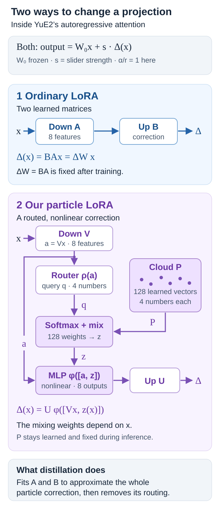

# YuE2 particle-to-LoRA distillation

All 16 released particle sliders were distilled into ordinary rank-8 LoRAs.
These experimental candidates preserve the original particle checkpoints and
do not replace the Space defaults.

[Hugging Face downloads and listening comparisons](https://huggingface.co/ntc-ai/yue2-concept-sliders#choose-your-adapter) · [GitHub archive mirror](https://github.com/mikkel/yue2-concept-sliders/releases/tag/distilled-rank8-20260917). Hugging Face includes native and ComfyUI weights, the standard-node workflow and all 128 recordings. The comparison archive includes a portable HTML listening page.

## What is being removed

### Ordinary LoRA versus our particle adapter

[Open the SVG at full size](assets/lora-vs-particle.svg).

Both adapters add a correction to a frozen projection: $y=W_0x+s\Delta(x)$, where $s$ is the slider strength. The native rank and alpha are both 8, so $\alpha/r=1$ in these equations.

$$
\begin{aligned}
\Delta_{\mathrm{LoRA}}(x) &= BAx, \\
\Delta_{\mathrm{particle}}(x) &= U\phi\!\left([Vx,z(x)]\right).
\end{aligned}
$$

- **Ordinary LoRA:** the down matrix $A$ compresses the input into eight features; the up matrix $B$ turns those features into a correction. After training, their product is one fixed matrix $\Delta W=BA$. For a fixed strength, it can be merged into the projection as $W_0+sBA$.
- **Our particle adapter:** the down features $a=Vx$ also enter a router. Its query assigns softmax weights to the cloud $P$, producing the mixture $z(x)$. A nonlinear network $\phi$ combines the original features with that mixture before the up matrix $U$. The cloud contains 128 learned four-dimensional vectors, shared across one slider’s 112 projection branches. The vectors stay fixed during inference; their mixing weights change with the input.

An ordinary LoRA still gives different corrections for different inputs, and the full YuE2 model remains nonlinear. The extra capability here is **nonlinear computation inside the adapter itself**. In general, that whole computation cannot be represented by one fixed weight update. It does not establish that particles produce better music.

**Distillation** learns new matrices $A$ and $B$ so that $BAx$ approximates the entire particle correction on representative activations. It is a learned approximation, not removal of the particle tensors from an existing checkpoint. The original teacher’s $U,V$ and the distilled student’s $A,B$ are separate parameters.

**ParticleGAN reference:** this experiment draws on [ParticleGAN](https://github.com/255BITS/ParticleGAN), with [reference revision `441fdf42`](https://github.com/255BITS/ParticleGAN/tree/441fdf42dd2c0905af312a303add422f700c0ac2), for learned particles, paired adversarial training, the gradient cap and the particle variance/covariance regularizer. The routed transformer adapter in this diagram is our YuE2 implementation. The critic is used during training; it is not part of either inference path shown here.

The teacher projection adds

$$\Delta_T(x)=U f(Vx,P).$$

Here the learned cloud $P$ and routed nonlinear bridge $f$ are the existing
particle implementation. The distilled student adds only

$$\Delta_S(x)=U A x.$$

Its saved tensors contain ordinary `lora_down`, `lora_up`, and `alpha` entries.
There is no router, bridge, particle cloud, custom ComfyUI node, or inference
MLP in the student. Every native projection has rank 8 and alpha 8.

## First pass: projection regression

Keep each teacher up matrix $U$. On real AR activations, find a linear down
matrix $A$ that approximates the teacher's eight output features $f(Vx,P)$.
Put input vectors $x_i^T$ in the rows of $X$ and corresponding teacher features
$f(Vx_i,P)^T$ in the rows of $Y$. Let
$D_{ii}=\sqrt{(X^T X)_{ii}}$ and $Z=XD^{-1}$. Solve

$$B=(Z^T Z+\lambda I)^{-1}Z^T Y,\qquad A=B^T D^{-1}.$$

The implementation floors the squared diagonal at $10^{-12}$ for numerical
stability. This is regression through the origin: it does not add a bias to
the LoRA. The teacher is nonlinear and has biases, so an exact match on all
possible inputs is not promised.

Each slider uses neutral captions from the audited training catalog, excluding
the lyric sheet reserved for validation, plus teacher-generated continuations
on its first three training rows. Each continuation has a 384-token guard and
a fixed seed from 4100–4102. Activations are collected with the teacher at
strength 0 and 1. Q/K/V share their input covariance; the O projection has its
own covariance. No held-out evaluation lyric sheet is used for fitting.

Choose ridge strength from 0.0001, 0.001 and 0.01 using the fourth training
row's continuation, seed 4103. Model selection uses the mean normalized error
at strengths 0.5 and 1, both at the first music-token boundary and throughout
the music continuation.

## Second pass: full-model distillation

Starting from the selected regression, optimize both ordinary LoRA matrices
for 100 Adam steps, learning rate 0.0001, gradient norm cap 1. The teacher and
base model stay frozen. Alternate continuation examples and broader training
captions, sampling strengths 0.5 and 1 with a fixed RNG seed. The loss is

$$L=\frac12\sum_{r\in\{boundary,music\}}
\frac{\mathrm{MSE}(h_S^{(r)},h_T^{(r)})}
{\max(\mathrm{MSE}(h_T^{(r)},h_0^{(r)}),10^{-7})}.$$

Evaluate the reserved training row every ten updates. Save the best checkpoint,
including step zero as a candidate. Refinement is discarded when it does not
improve that validation score. Test-set measurements never choose the winner.

## Evaluation and its limits

The existing two held-out prompts, seed 1709, supply both base-generated and
teacher-generated token trajectories. At strengths 0.5 and 1, measure:

$$E=\frac{\|h_S-h_T\|^2}{\|h_T-h_0\|^2},\qquad
C=\frac{(h_S-h_0)\cdot(h_T-h_0)}{\|h_S-h_0\|\|h_T-h_0\|}.$$

Error zero is an exact teacher match; error one is what leaving the slider off
would produce. Cosine one means aligned steering. Report the first-token
boundary separately from the music sequence. Also report teacher-to-student
and teacher-to-base KL over the codec vocabulary at every 32nd music position,
before sampling penalties and classifier-free guidance.

These metrics concern teacher fidelity, not perceptual quality. Small teacher
effects can make BF16 rounding a substantial part of the normalized error.
Autoregressive sampling can diverge despite small distribution errors. The
experiment does not establish full-song quality, mixed-slider behavior,
negative strengths, or strengths above one.

Render two fresh matched groups per slider: Off, original particles, plain
LoRA during AR only, and the same plain semantic sequence with its LoRA also
active during acoustic-prefix conditioning. Every clip uses seed 1709, a
500-token / approximately 20-second diagnostic guard and 16 acoustic ODE steps.
Check finite stereo 48 kHz audio and nonzero signal. The acoustic-prefix test
mirrors standard ComfyUI scope in the native runtime; it is not a full ComfyUI
audio render or a blind listening evaluation.

## ComfyUI

Use the **standard Load LoRA node**. Connect MODEL and CLIP from the YuE2
checkpoint loader. Set model strength **0**, CLIP strength **1**; reduce CLIP
strength toward zero to reduce the effect. Use `off` planning mode for the
same semantic-only setup used in this experiment. The workflow keeps the
native 360-second upper guard; it is not the 20-second diagnostic setting.

Place a `*_comfyui.safetensors` download in `ComfyUI/models/loras/` and load
`workflow.json`. The ordinary LoRA also changes the acoustic-prefix conditioning
computed by YuE2's text encoder. The fourth player makes that difference
reviewable. The acoustic denoiser and VAE receive no LoRA tensors.

Conversion extends the existing `mikkel/conceptmod` converter, published in
[a5c3dd8](https://github.com/mikkel/conceptmod/commit/a5c3dd8), in the existing shared converter. There is no second converter in this repository. Q/K/V are fused by concatenating the down
matrices and block-diagonalizing the up matrices, preserving alpha/rank.
Their fused rank is 24; O stays rank 8. This is an exact rearrangement of the
linear updates before BF16 export rounding.

The native regression recovery test passes. Converter tests include unequal
Q/K/V output widths, unequal alpha scales, rejection of nonlinear particle
checkpoints and incomplete QKV groups, and application through the real
ComfyUI YuE2 LoRA loader. The relevant converter suite has 32 passing tests.

## Provenance

Each selected checkpoint records its teacher hash, model identity, recipe,
hyperparameters and source hashes. The experimental release retains the final
held-out measurements and validation selection histories. Source teachers and
prompt YAMLs are in the original Hugging Face model release. Both GPUs were
used for distillation; the original Space and particle weights remain available.

The experiment uses the native YuE2 implementation pinned in this repository.
The complete model identifiers and SHA256 checks are in each checkpoint’s
metadata and in the archive’s validation report.

Weights retain the original release's CC BY-NC 4.0 terms. The ComfyUI workflow
is derived from the existing workflow distributed with the particle release;
its original workflow license accompanies this comparison.

## Final measurements

All 16 distillations and 128 diagnostic recordings completed on both GPUs. Every converted file loaded all 56 fused attention patches through the real ComfyUI LoRA loader. The native files contain only ordinary LoRA tensors.

Values below average the music-region measurements across two held-out prompts, base and teacher token trajectories, and strengths 0.5 and 1. Lower relative MSE is better; zero is exact agreement, and one is the error from leaving the slider off. These are teacher-fidelity diagnostics, not percentages of perceptual quality.

| Control | Relative steering MSE | Steering cosine |
|---|---:|---:|
| female | 0.3832 | 0.7979 |
| male | 0.3998 | 0.7894 |
| pop | 0.1258 | 0.9359 |
| hiphop | 0.0205 | 0.9897 |
| rnb | 0.0480 | 0.9759 |
| indie-rock | 0.0474 | 0.9764 |
| pop-punk | 0.0175 | 0.9913 |
| metal | 0.0295 | 0.9854 |
| country | 0.0337 | 0.9830 |
| acoustic-folk | 0.0837 | 0.9577 |
| house | 0.0552 | 0.9723 |
| disco-funk | 0.0457 | 0.9778 |
| kpop | 0.0628 | 0.9682 |
| reggaeton | 0.0236 | 0.9885 |
| afrobeats | 0.0222 | 0.9889 |
| lofi | 0.0429 | 0.9785 |

[Aggregated measurements](validation/distillation-summary.json) · [Export and audio checks](validation/distillation.json) · [Validation histories and held-out measurements](validation/distillation/)
