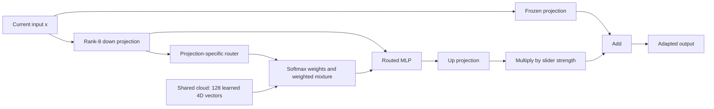

# YuE2 Concept Sliders

Sixteen voice and genre controls for **YuE2-3B**, using our native routed-particle adapters. Keep the sound description, lyrics and seed fixed, then adjust the strength of a learned concept during composition.

**[Try the Space](https://huggingface.co/spaces/ntc-ai/yue2-concept-sliders)** · **[Download weights and hear Off/On samples](https://huggingface.co/ntc-ai/yue2-concept-sliders)** · **[ComfyUI guide](comfyui/ntc_yue2_sliders/README.md)** · **[Native Python guide](USAGE.md)** · **[Training math](MATH.md)**

This repository contains the inference loader, ComfyUI custom node and workflow, Space source, catalog and method documentation. Weights and recordings are hosted on Hugging Face. The release contains final EMA checkpoints at update **1,200**, with **64 matched Off/On listening pairs**.

## Controls

| Voice | Genre and arrangement |
| --- | --- |
| Female, Male | Pop, Hip-hop, R&B, Indie rock, Pop punk, Metal, Country, Acoustic folk, House, Disco/Funk, K-pop, Reggaeton, Afrobeats, Lo-fi |

Strength **0** exactly bypasses the adapter, **0.5** applies half the residual, and **1** is the trained positive endpoint. Perceived musical changes need not be linear in strength. Negative values are not trained opposites; the release's negative-strength recordings are unscored canaries.

## What are the particles?

A particle is a small learned vector. Each slider has **128 vectors of four numbers each**, stored as a shared matrix `P`. They are model parameters, learned with the rest of the adapter and saved in the checkpoint. They are not audio snippets, individual instruments, or random noise sampled during generation.

Every attention projection has a small router. At each input, that router asks the shared cloud for a different weighted mixture of its vectors. A second small network combines that mixture with the current features to produce the correction to the frozen base projection.



The cloud is shared across the **112 Q/K/V/O projection branches** in YuE2's 28 autoregressive layers. Each branch has its own down/up projections, router and MLP. Different sliders have different learned clouds. The particles do not have assigned names or an established one-particle-to-one-musical-property interpretation.

### Inference math

Using column vectors, let `x` be a projection input, `V` its down projection, `U` its up projection, `ρ` its router and `φ` its routed MLP:

$$
\begin{aligned}
a &= Vx, & q &= \rho(a), \\
w &= \operatorname{softmax}(Pq/\sqrt{4}), & z &= P^\top w, \\
f_s(x) &= f_0(x) + s\,\frac{\alpha}{r}\,U\phi([a,z]).
\end{aligned}
$$

Here `a` has 8 coordinates, `q` and `z` have 4, `w` has 128, and `[a,z]` has 12. Rank `r` and alpha `α` are both 8, so their ratio is 1. Routers have three width-16 hidden layers; routed MLPs have three width-48 hidden layers. Both use LeakyReLU with slope 0.2. The cloud and routing remain active during inference; the training critic is not needed for inference.

Adapter arithmetic runs in FP32 and its output is cast back to the base activation dtype. Hooks apply during autoregressive planning/composition and are removed before acoustic synthesis and VAE decoding. The base model remains frozen.

## Why use particles, and why is a custom loader required?

The design gives the adapter a shared set of learned vectors that each projection can combine according to its current input. That adds an input-dependent nonlinear path while retaining small rank-8 input/output projections. The training regularizer encourages variation across the cloud's coordinates and discourages correlated coordinates; the routing objective also trains the cloud through backpropagation.

An ordinary LoRA branch computes `U(Vx)`. Its effective weight update is the fixed matrix `UV`, which can be merged into a linear base weight. Our branch instead computes `U φ([Vx, z(x)])`: the softmax routing and MLP depend on the input. In general, a fixed weight delta cannot represent that mapping.

**These checkpoints therefore need the particles, routers and MLPs at inference.** Keeping only the down/up matrices discards learned computation and does not reproduce the trained model. The native loader and our ComfyUI node preserve every part of the branch; a generic Load LoRA node does not.

Particles are an architectural choice in this experiment, not a requirement for YuE2 itself or for all concept sliders. This release does not include an ablation establishing that particles outperform ordinary LoRA. Their necessity here follows from how these particular weights were trained. Our [MiniMax Music 3 sliders](https://huggingface.co/ntc-ai/minimax-music3-concept-sliders) use a different adapter format and loading path.

## Use in ComfyUI

Use an updated ComfyUI with its built-in YuE2 nodes. Install this repository directly as a custom node:

```bash
cd /path/to/ComfyUI/custom_nodes
git clone https://github.com/mikkel/yue2-concept-sliders.git
```

Download [native slider files](https://huggingface.co/ntc-ai/yue2-concept-sliders/tree/main/weights/particle-1200-v1) into `ComfyUI/models/loras/yue2/`. For example, place `female_step1200.safetensors` directly inside that folder. Put the [official ComfyUI YuE2 BF16 checkpoint](https://huggingface.co/Comfy-Org/YuE2) in `ComfyUI/models/checkpoints/`, then restart ComfyUI.

Load [workflow.json](comfyui/ntc_yue2_sliders/workflow.json), or insert **YuE2 Concept Slider (ntc-ai)** between the checkpoint's **CLIP** output and **YuE2 Generate Music**. The MODEL and VAE connections continue through the standard workflow. Do not also install the ZIP version of the same node.

ComfyUI fuses Q/K/V into one projection. Our node adds each native particle branch to its corresponding output slice and patches O separately. It restores the original projection functions before acoustic prefix conditioning, including on exceptions. [Installation and compatibility details](comfyui/ntc_yue2_sliders/README.md).

## Native Python and the Space

[USAGE.md](USAGE.md) provides a runnable native example using the original YuE2 runtime. The inference classes in [slider_runtime.py](slider_runtime.py) are extracted from the training implementation; [source-provenance.json](source-provenance.json) records source hashes.

The [Space](https://huggingface.co/spaces/ntc-ai/yue2-concept-sliders) defaults to **Automatic** song length: YuE2 decides when to emit its ending token, with the upstream 9,000-token safety guard. Limited mode adds an optional duration cap. The Space uses the native CUDA-graph decoder with our particle branches captured. GPU reservations are capped at 120 seconds after the Spaces hardware multiplier; this reservation is separate from the audio duration and does not shorten the sampler's token budget. Visitor quota and execution limits still apply.

[space/](space/) contains the deployed application source and upstream runtime, pinned to YuE2 revision `ef1936f2ee39fe8de486a0f47a481c95f8d4da87`. Its README documents the tested dependencies and ZeroGPU setup.

## How training works

Each control uses four neutral/positive sound-description pairs with matching lyrics. The frozen model's final prompt hidden state under the positive description supplies the target; the adapted model receives the neutral description. A critic learns to distinguish Gaussian noise from the same noise plus the normalized paired hidden-state error. The adapter learns to reduce that distinction, alongside the particle variance/covariance regularizer. The base model, acoustic stage and VAE remain frozen.

The release exports the exponential moving average of all learned adapter parameters, including the cloud and routers, at update 1,200. The EMA decay is 0.995. The noise schedule spans 8,000 updates and is deliberately unfinished at this checkpoint. See [MATH.md](MATH.md) for the complete objectives, gradient cap, regularizer, normalization and optimizer settings.

These are experimental controls. Hidden-state diagnostics do not establish audio quality, lyric preservation or reliable endings; there is no added ending-supervision loss. Listen to the [held-out comparisons](https://huggingface.co/ntc-ai/yue2-concept-sliders) when judging a control.

## Validation

The native loader passed a CPU roundtrip and bitwise comparison against the training loader at strengths 0, 0.5 and 1. All 16 released checkpoints passed tensor, shape and finite-value checks.

The ComfyUI integration passed native projection parity, exact zero bypass, clone isolation, actual ComfyUI AR sampling, unchanged acoustic conditioning, exception cleanup and malformed-checkpoint rejection. These checks ran on CPU against ComfyUI commit `387f98aa2822f684b8597959a52a467d88cc4806`. Full GPU audio workflows, quantized bases and third-party YuE2 node packs remain unvalidated. Results are in [validation/comfyui.json](validation/comfyui.json).

To repeat the CPU integration check, use a separate environment with that ComfyUI checkout's dependencies and a downloaded slider snapshot containing the original `weights/` directory:

```bash
python verify_comfy.py /path/to/ComfyUI /path/to/slider-snapshot
```

A live Space test produced a naturally ended **58.20-second song in 28.23 seconds**, with valid 48 kHz stereo audio and a 34-second GPU reservation. [Recorded generation details](validation/space.json).

## Licenses and attribution

The native adapter loader and ComfyUI integration use the [MIT license](LICENSE), preserving the upstream notice. The bundled YuE2 inference code uses [Apache-2.0](space/upstream-licenses/LICENSE), with [third-party notices](space/upstream-licenses/THIRD_PARTY_NOTICES.md). The example workflow derives from the official ComfyUI template and retains its [MIT notice](comfyui/ntc_yue2_sliders/WORKFLOW_LICENSE).

Adapter weights, YuE2-3B and YuE2-Vae use **CC BY-NC 4.0**; the code license does not change the model terms. See the [model card](https://huggingface.co/ntc-ai/yue2-concept-sliders) and [upstream model license](space/upstream-licenses/MODEL_LICENSE).

Use sound descriptions and original lyrics in prompts: instruments, voice, kit, amp, mic, room, breath and time-feel. Released prompts and checkpoint metadata were checked for named music references.
